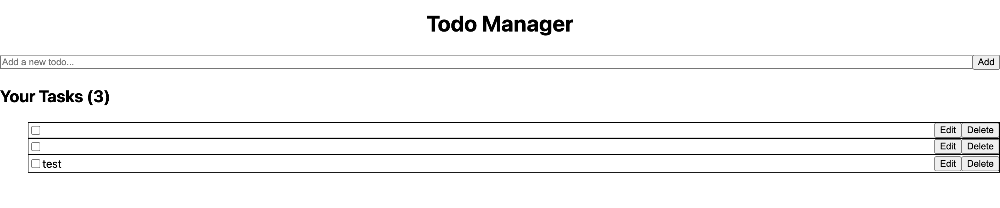

# %% user
Code a modern react-vite-tailwind todo manager app with features to add, delete, edit, mark as done.
Create in /tmp/app-react-vite-92r
# %% assistant
I'll create a React todo manager app using Vite and Tailwind CSS. Let me start by initializing the project.

```tool_call
<tool_call>
<tool_name>Initialize</tool_name>
<param name="type">first_call</param>
<param name="any_workspace_path">/tmp</param>
<param name="initial_files_to_read">[]</param>
<param name="task_id_to_resume"></param>
<param name="mode_name">wcgw</param>
</tool_call>
```

# %% tool_execute
<tool_result>
[Tool Result](cmdassets/tool-result-20250414-180412-6u42y3.txt)
</tool_result>

# %% assistant
I'll create a React todo manager app using Vite and Tailwind CSS in the specified directory. Let's start by creating the project structure.

```tool_call
<tool_call>
<tool_name>BashCommand</tool_name>
<param name="action_json">{"command":"mkdir -p /tmp/app-react-vite-92r && cd /tmp/app-react-vite-92r && npm create vite@latest . -- --template react"}</param>
</tool_call>
```

# %% tool_execute
```
<tool_result>
> npx
> cva . --template react

│
◇  Scaffolding project in /private/tmp/app-react-vite-92r...
│
└  Done. Now run:

  npm install
  npm run dev

---

status = process exited
cwd = /tmp/app-react-vite-92r
</tool_result>
```

# %% assistant
Now let's install the dependencies including Tailwind CSS:

```tool_call
<tool_call>
<tool_name>BashCommand</tool_name>
<param name="action_json">{"command":"cd /tmp/app-react-vite-92r && npm install && npm install -D tailwindcss postcss autoprefixer"}</param>
</tool_call>
```

# %% tool_execute
```
<tool_result>
⠹

---

status = still running
running for = 3 seconds
cwd = /tmp/app-react-vite-92r
</tool_result>
```

# %% assistant
Let's wait for the installation to complete:

```tool_call
<tool_call>
<tool_name>BashCommand</tool_name>
<param name="action_json">{"status_check":true}</param>
</tool_call>
```

# %% tool_execute
```
<tool_result>
added 150 packages, and audited 151 packages in 9s

30 packages are looking for funding
  run `npm fund` for details

found 0 vulnerabilities

added 6 packages, and audited 157 packages in 1s

32 packages are looking for funding
  run `npm fund` for details

found 0 vulnerabilities

---

status = process exited
cwd = /tmp/app-react-vite-92r
</tool_result>
```

# %% assistant
Now let's initialize Tailwind CSS:

```tool_call
<tool_call>
<tool_name>BashCommand</tool_name>
<param name="action_json">{"command":"cd /tmp/app-react-vite-92r && npx tailwindcss init -p"}</param>
</tool_call>
```

# %% tool_execute
```
<tool_result>
≈ tailwindcss v4.0.14

Invalid command: init

Usage:
  tailwindcss [options]

Options:
  -i, --input ··········· Input file
  -o, --output ·········· Output file [default: `-`]
  -w, --watch ··········· Watch for changes and rebuild as needed
  -m, --minify ·········· Optimize and minify the output
      --optimize ········ Optimize the output without minifying
      --cwd ············· The current working directory [default: `.`]
  -h, --help ············ Display usage information

---

status = process exited
cwd = /tmp/app-react-vite-92r
</tool_result>
```

# %% assistant
Let's try the correct syntax for the newer version of Tailwind CSS:

```tool_call
<tool_call>
<tool_name>BashCommand</tool_name>
<param name="action_json">{"command":"cd /tmp/app-react-vite-92r && npm install -D @tailwindcss/cli && npx tailwindcss -i"}</param>
</tool_call>
```

# %% tool_execute
```
<tool_result>
⠙

---

status = still running
running for = 3 seconds
cwd = /tmp/app-react-vite-92r
</tool_result>
```

# %% assistant
Let's check the status:

```tool_call
<tool_call>
<tool_name>BashCommand</tool_name>
<param name="action_json">{"status_check":true}</param>
</tool_call>
```

# %% tool_execute
```
<tool_result>
added 22 packages, and audited 179 packages in 6s

37 packages are looking for funding
  run `npm fund` for details

found 0 vulnerabilities
≈ tailwindcss v4.1.4

Specified input file `./true` does not exist.

---

status = process exited
cwd = /tmp/app-react-vite-92r
</tool_result>
```

# %% assistant
Let's try a different approach. We'll create the Tailwind configuration files manually:

```tool_call
<tool_call>
<tool_name>BashCommand</tool_name>
<param name="action_json">{"command":"cd /tmp/app-react-vite-92r && mkdir -p src/components"}</param>
</tool_call>
```

# %% tool_execute
```
<tool_result>


---

status = process exited
cwd = /tmp/app-react-vite-92r
</tool_result>
```

# %% assistant
Now let's check the existing structure to understand what files we need to modify:

```tool_call
<tool_call>
<tool_name>BashCommand</tool_name>
<param name="action_json">{"command":"cd /tmp/app-react-vite-92r && ls -la"}</param>
</tool_call>
```

# %% tool_execute
```
<tool_result>
total 304
drwxr-xr-x@  12 arusia  wheel     384 Apr 14 23:34 .
drwxrwxrwt   50 root    wheel    1600 Apr 14 23:34 ..
-rw-r--r--@   1 arusia  wheel     253 Apr 14 23:34 .gitignore
-rw-r--r--@   1 arusia  wheel     809 Apr 14 23:34 README.md
-rw-r--r--@   1 arusia  wheel     844 Apr 14 23:34 eslint.config.js
-rw-r--r--@   1 arusia  wheel     361 Apr 14 23:34 index.html
drwxr-xr-x@ 135 arusia  wheel    4320 Apr 14 23:34 node_modules
-rw-r--r--@   1 arusia  wheel  128053 Apr 14 23:34 package-lock.json
-rw-r--r--@   1 arusia  wheel     736 Apr 14 23:34 package.json
drwxr-xr-x@   3 arusia  wheel      96 Apr 14 23:34 public
drwxr-xr-x@   8 arusia  wheel     256 Apr 14 23:35 src
-rw-r--r--@   1 arusia  wheel     161 Apr 14 23:34 vite.config.js

---

status = process exited
cwd = /tmp/app-react-vite-92r
</tool_result>
```

# %% assistant
Let's check what files are in the src directory:

```tool_call
<tool_call>
<tool_name>BashCommand</tool_name>
<param name="action_json">{"command":"cd /tmp/app-react-vite-92r && ls -la src"}</param>
</tool_call>
```

# %% tool_execute
```
<tool_result>
total 32
drwxr-xr-x@  8 arusia  wheel   256 Apr 14 23:35 .
drwxr-xr-x@ 12 arusia  wheel   384 Apr 14 23:34 ..
-rw-r--r--@  1 arusia  wheel   606 Apr 14 23:34 App.css
-rw-r--r--@  1 arusia  wheel   903 Apr 14 23:34 App.jsx
drwxr-xr-x@  3 arusia  wheel    96 Apr 14 23:34 assets
drwxr-xr-x@  2 arusia  wheel    64 Apr 14 23:35 components
-rw-r--r--@  1 arusia  wheel  1154 Apr 14 23:34 index.css
-rw-r--r--@  1 arusia  wheel   229 Apr 14 23:34 main.jsx

---

status = process exited
cwd = /tmp/app-react-vite-92r
</tool_result>
```

# %% assistant
Now let's create the necessary Tailwind configuration files:

```tool_call
<tool_call>
<tool_name>FileWriteOrEdit</tool_name>
<param name="file_path">/tmp/app-react-vite-92r/tailwind.config.js</param>
<param name="percentage_to_change">100</param>
<param name="file_content_or_search_replace_blocks">/** @type {import('tailwindcss').Config} */
export default {
  content: [
    "./index.html",
    "./src/**/*.{js,ts,jsx,tsx}",
  ],
  theme: {
    extend: {},
  },
  plugins: [],
}</param>
</tool_call>
```

# %% tool_execute
```
<tool_result>
Success
</tool_result>
```

# %% assistant
Now let's update the index.css file to include Tailwind directives:

```tool_call
<tool_call>
<tool_name>FileWriteOrEdit</tool_name>
<param name="file_path">/tmp/app-react-vite-92r/src/index.css</param>
<param name="percentage_to_change">100</param>
<param name="file_content_or_search_replace_blocks">@tailwind base;
@tailwind components;
@tailwind utilities;</param>
</tool_call>
```

# %% tool_execute
<tool_result>
[Tool Result](cmdassets/tool-result-20250414-180629-itw25d.txt)
</tool_result>

# %% assistant
Let's update the index.css file to include Tailwind directives while preserving necessary styles:

```tool_call
<tool_call>
<tool_name>FileWriteOrEdit</tool_name>
<param name="file_path">/tmp/app-react-vite-92r/src/index.css</param>
<param name="percentage_to_change">100</param>
<param name="file_content_or_search_replace_blocks">@tailwind base;
@tailwind components;
@tailwind utilities;

:root {
  font-family: system-ui, Avenir, Helvetica, Arial, sans-serif;
  line-height: 1.5;
  font-weight: 400;
  color-scheme: light dark;
}

body {
  margin: 0;
  min-width: 320px;
  min-height: 100vh;
}</param>
</tool_call>
```

# %% tool_execute
```
<tool_result>
Success
</tool_result>
```

# %% assistant
Let's also check and update the App.jsx file to start building our todo app:

```tool_call
<tool_call>
<tool_name>ReadFiles</tool_name>
<param name="file_paths">["/tmp/app-react-vite-92r/src/App.jsx"]</param>
</tool_call>
```

# %% tool_execute
<tool_result>
[Tool Result](cmdassets/tool-result-20250414-180639-lc7m1e.txt)
</tool_result>

# %% assistant
Let's check the App.css file to understand what styles we need to modify:

```tool_call
<tool_call>
<tool_name>ReadFiles</tool_name>
<param name="file_paths">["/tmp/app-react-vite-92r/src/App.css"]</param>
</tool_call>
```

# %% tool_execute
<tool_result>
[Tool Result](cmdassets/tool-result-20250414-180642-ce8hb2.txt)
</tool_result>

# %% assistant
Now I'll create the components for our Todo app:

1. First, let's create a TodoItem component:

```tool_call
<tool_call>
<tool_name>FileWriteOrEdit</tool_name>
<param name="file_path">/tmp/app-react-vite-92r/src/components/TodoItem.jsx</param>
<param name="percentage_to_change">100</param>
<param name="file_content_or_search_replace_blocks">import { useState } from 'react';

function TodoItem({ todo, onDelete, onToggle, onEdit }) {
  const [isEditing, setIsEditing] = useState(false);
  const [editText, setEditText] = useState(todo.text);

  const handleEdit = () => {
    onEdit(todo.id, editText);
    setIsEditing(false);
  };

  return (
    <li className="flex items-center justify-between p-3 mb-2 border rounded-lg shadow-sm bg-white dark:bg-gray-800 border-gray-200 dark:border-gray-700">
      {isEditing ? (
        <div className="flex items-center flex-1 gap-2">
          <input
            type="text"
            value={editText}
            onChange={(e) => setEditText(e.target.value)}
            className="flex-1 px-3 py-2 border rounded-md focus:outline-none focus:ring-2 focus:ring-blue-500 dark:bg-gray-700 dark:border-gray-600"
            autoFocus
          />
          <button
            onClick={handleEdit}
            className="px-3 py-1 text-white bg-green-500 rounded-md hover:bg-green-600 focus:outline-none focus:ring-2 focus:ring-green-500"
          >
            Save
          </button>
          <button
            onClick={() => setIsEditing(false)}
            className="px-3 py-1 text-white bg-gray-500 rounded-md hover:bg-gray-600 focus:outline-none focus:ring-2 focus:ring-gray-500"
          >
            Cancel
          </button>
        </div>
      ) : (
        <>
          <div className="flex items-center gap-3 flex-1">
            <input
              type="checkbox"
              checked={todo.completed}
              onChange={() => onToggle(todo.id)}
              className="w-5 h-5 rounded text-blue-600 focus:ring-blue-500"
            />
            <span className={`${todo.completed ? 'line-through text-gray-500' : 'text-gray-800 dark:text-gray-200'}`}>
              {todo.text}
            </span>
          </div>
          <div className="flex space-x-2">
            <button
              onClick={() => setIsEditing(true)}
              className="px-2 py-1 text-sm text-white bg-blue-500 rounded-md hover:bg-blue-600 focus:outline-none focus:ring-2 focus:ring-blue-500"
            >
              Edit
            </button>
            <button
              onClick={() => onDelete(todo.id)}
              className="px-2 py-1 text-sm text-white bg-red-500 rounded-md hover:bg-red-600 focus:outline-none focus:ring-2 focus:ring-red-500"
            >
              Delete
            </button>
          </div>
        </>
      )}
    </li>
  );
}

export default TodoItem;</param>
</tool_call>
```

# %% tool_execute
```
<tool_result>
Success
</tool_result>
```

# %% assistant
Now let's create the TodoList component:

```tool_call
<tool_call>
<tool_name>FileWriteOrEdit</tool_name>
<param name="file_path">/tmp/app-react-vite-92r/src/components/TodoList.jsx</param>
<param name="percentage_to_change">100</param>
<param name="file_content_or_search_replace_blocks">import TodoItem from './TodoItem';

function TodoList({ todos, onDelete, onToggle, onEdit }) {
  if (todos.length === 0) {
    return (
      <div className="p-4 text-center text-gray-500 border rounded-lg border-gray-200 dark:border-gray-700">
        No todos yet. Add one above!
      </div>
    );
  }

  return (
    <ul className="mt-4">
      {todos.map((todo) => (
        <TodoItem
          key={todo.id}
          todo={todo}
          onDelete={onDelete}
          onToggle={onToggle}
          onEdit={onEdit}
        />
      ))}
    </ul>
  );
}

export default TodoList;</param>
</tool_call>
```

# %% tool_execute
```
<tool_result>
Success
</tool_result>
```

# %% assistant
Now let's create the TodoForm component:

```tool_call
<tool_call>
<tool_name>FileWriteOrEdit</tool_name>
<param name="file_path">/tmp/app-react-vite-92r/src/components/TodoForm.jsx</param>
<param name="percentage_to_change">100</param>
<param name="file_content_or_search_replace_blocks">import { useState } from 'react';

function TodoForm({ onAdd }) {
  const [text, setText] = useState('');

  const handleSubmit = (e) => {
    e.preventDefault();
    if (text.trim()) {
      onAdd(text);
      setText('');
    }
  };

  return (
    <form onSubmit={handleSubmit} className="mb-6">
      <div className="flex items-center gap-2">
        <input
          type="text"
          value={text}
          onChange={(e) => setText(e.target.value)}
          placeholder="Add a new todo..."
          className="flex-1 px-4 py-2 border rounded-lg shadow-sm focus:outline-none focus:ring-2 focus:ring-blue-500 dark:bg-gray-800 dark:border-gray-700 dark:text-white"
        />
        <button
          type="submit"
          className="px-4 py-2 font-medium text-white bg-blue-600 rounded-lg shadow-sm hover:bg-blue-700 focus:outline-none focus:ring-2 focus:ring-blue-500"
        >
          Add
        </button>
      </div>
    </form>
  );
}

export default TodoForm;</param>
</tool_call>
```

# %% tool_execute
```
<tool_result>
Success
</tool_result>
```

# %% assistant
Now let's update the App.jsx file to implement our Todo Manager app:

```tool_call
<tool_call>
<tool_name>FileWriteOrEdit</tool_name>
<param name="file_path">/tmp/app-react-vite-92r/src/App.jsx</param>
<param name="percentage_to_change">100</param>
<param name="file_content_or_search_replace_blocks">import { useState, useEffect } from 'react'
import TodoForm from './components/TodoForm'
import TodoList from './components/TodoList'
import './App.css'

function App() {
  const [todos, setTodos] = useState(() => {
    const savedTodos = localStorage.getItem('todos')
    if (savedTodos) {
      return JSON.parse(savedTodos)
    } else {
      return []
    }
  })

  useEffect(() => {
    localStorage.setItem('todos', JSON.stringify(todos))
  }, [todos])

  const addTodo = (text) => {
    const newTodo = {
      id: Date.now(),
      text,
      completed: false
    }
    setTodos([...todos, newTodo])
  }

  const deleteTodo = (id) => {
    setTodos(todos.filter(todo => todo.id !== id))
  }

  const toggleTodo = (id) => {
    setTodos(
      todos.map(todo => 
        todo.id === id ? { ...todo, completed: !todo.completed } : todo
      )
    )
  }

  const editTodo = (id, newText) => {
    setTodos(
      todos.map(todo => 
        todo.id === id ? { ...todo, text: newText } : todo
      )
    )
  }

  return (
    <div className="min-h-screen bg-gray-100 dark:bg-gray-900">
      <div className="container max-w-md p-4 mx-auto pt-12">
        <div className="p-6 bg-white rounded-lg shadow-md dark:bg-gray-800">
          <h1 className="mb-6 text-2xl font-bold text-center text-gray-800 dark:text-white">
            Todo Manager
          </h1>
          
          <TodoForm onAdd={addTodo} />
          
          <div className="mb-4">
            <h2 className="text-lg font-semibold text-gray-700 dark:text-gray-300">
              Your Tasks ({todos.length})
            </h2>
          </div>
          
          <TodoList 
            todos={todos}
            onDelete={deleteTodo}
            onToggle={toggleTodo}
            onEdit={editTodo}
          />
        </div>
      </div>
    </div>
  )
}

export default App</param>
</tool_call>
```

# %% tool_execute
```
<tool_result>
Success
</tool_result>
```

# %% assistant
Now let's update the App.css to simplify it since we're using Tailwind:

```tool_call
<tool_call>
<tool_name>FileWriteOrEdit</tool_name>
<param name="file_path">/tmp/app-react-vite-92r/src/App.css</param>
<param name="percentage_to_change">100</param>
<param name="file_content_or_search_replace_blocks">/* Custom styles can be added here if needed beyond Tailwind */</param>
</tool_call>
```

# %% tool_execute
```
<tool_result>
Success
</tool_result>
```

# %% assistant
Let's update the postcss.config.js file to ensure Tailwind is properly configured:

```tool_call
<tool_call>
<tool_name>FileWriteOrEdit</tool_name>
<param name="file_path">/tmp/app-react-vite-92r/postcss.config.js</param>
<param name="percentage_to_change">100</param>
<param name="file_content_or_search_replace_blocks">export default {
  plugins: {
    tailwindcss: {},
    autoprefixer: {},
  },
}</param>
</tool_call>
```

# %% tool_execute
```
<tool_result>
Success
</tool_result>
```

# %% assistant
Let's also update the index.html file to include a proper title and description:

```tool_call
<tool_call>
<tool_name>ReadFiles</tool_name>
<param name="file_paths">["/tmp/app-react-vite-92r/index.html"]</param>
</tool_call>
```

# %% tool_execute
```
<tool_result>

/tmp/app-react-vite-92r/index.html
```
<!doctype html>
<html lang="en">
  <head>
    <meta charset="UTF-8" />
    <link rel="icon" type="image/svg+xml" href="/vite.svg" />
    <meta name="viewport" content="width=device-width, initial-scale=1.0" />
    <title>Vite + React</title>
  </head>
  <body>
    <div id="root"></div>
    <script type="module" src="/src/main.jsx"></script>
  </body>
</html>
```
</tool_result>
```

# %% assistant
Let's update the index.html file:

```tool_call
<tool_call>
<tool_name>FileWriteOrEdit</tool_name>
<param name="file_path">/tmp/app-react-vite-92r/index.html</param>
<param name="percentage_to_change">30</param>
<param name="file_content_or_search_replace_blocks"><<<<<<< SEARCH
    <title>Vite + React</title>
=======
    <title>Todo Manager | React + Vite + Tailwind</title>
    <meta name="description" content="A modern todo management application built with React, Vite, and Tailwind CSS" />
>>>>>>> REPLACE</param>
</tool_call>
```

# %% tool_execute
```
<tool_result>
Edited successfully
</tool_result>
```

# %% assistant
Finally, let's make sure our project is ready to run and test if everything is working properly:

```tool_call
<tool_call>
<tool_name>BashCommand</tool_name>
<param name="action_json">{"command":"cd /tmp/app-react-vite-92r && npm run build"}</param>
</tool_call>
```

# %% tool_execute
```
<tool_result>
> app-react-vite-92r@0.0.0 build
> vite build

vite v6.2.6 building for production...
✓ 3 modules transformed.
✗ Build failed in 49ms
error during build:
[vite:css] [postcss] It looks like you're trying to use `tailwindcss` directly as a PostCSS plugin. The PostCSS plugin has moved to a separate package, so to co
ntinue using Tailwind CSS with PostCSS you'll need to install `@tailwindcss/postcss` and update your PostCSS configuration.
file: /private/tmp/app-react-vite-92r/src/index.css:undefined:NaN
    at Le (/private/tmp/app-react-vite-92r/node_modules/tailwindcss/dist/lib.js:36:1984)
    at LazyResult.runOnRoot (/private/tmp/app-react-vite-92r/node_modules/postcss/lib/lazy-result.js:361:16)
    at LazyResult.runAsync (/private/tmp/app-react-vite-92r/node_modules/postcss/lib/lazy-result.js:290:26)
    at LazyResult.async (/private/tmp/app-react-vite-92r/node_modules/postcss/lib/lazy-result.js:192:30)
    at LazyResult.then (/private/tmp/app-react-vite-92r/node_modules/postcss/lib/lazy-result.js:436:17)

---

status = process exited
cwd = /tmp/app-react-vite-92r
</tool_result>
```

# %% assistant
Let's fix the Tailwind configuration issue. We need to install the correct PostCSS plugin:

```tool_call
<tool_call>
<tool_name>BashCommand</tool_name>
<param name="action_json">{"command":"cd /tmp/app-react-vite-92r && npm install @tailwindcss/postcss"}</param>
</tool_call>
```

# %% tool_execute
```
<tool_result>
added 2 packages, and audited 181 packages in 900ms

38 packages are looking for funding
  run `npm fund` for details

found 0 vulnerabilities

---

status = process exited
cwd = /tmp/app-react-vite-92r
</tool_result>
```

# %% assistant
Now let's update the postcss.config.js file to use the correct plugin:

```tool_call
<tool_call>
<tool_name>FileWriteOrEdit</tool_name>
<param name="file_path">/tmp/app-react-vite-92r/postcss.config.js</param>
<param name="percentage_to_change">100</param>
<param name="file_content_or_search_replace_blocks">export default {
  plugins: {
    '@tailwindcss/postcss': {},
    autoprefixer: {},
  },
}</param>
</tool_call>
```

# %% tool_execute
```
<tool_result>
Success
</tool_result>
```

# %% assistant
Let's try building the project again:

```tool_call
<tool_call>
<tool_name>BashCommand</tool_name>
<param name="action_json">{"command":"cd /tmp/app-react-vite-92r && npm run build"}</param>
</tool_call>
```

# %% tool_execute
```
<tool_result>
> app-react-vite-92r@0.0.0 build
> vite build

vite v6.2.6 building for production...
✓ 33 modules transformed.
dist/index.html                   0.61 kB │ gzip:  0.37 kB
dist/assets/index-CkV0TMZ9.css    2.57 kB │ gzip:  0.80 kB
dist/assets/index-DXpLfFup.js   191.08 kB │ gzip: 60.10 kB
✓ built in 535ms

---

status = process exited
cwd = /tmp/app-react-vite-92r
</tool_result>
```

# %% assistant
Great! The build was successful. Now let's see if we can run the development server to check the application:

```tool_call
<tool_call>
<tool_name>BashCommand</tool_name>
<param name="action_json">{"command":"cd /tmp/app-react-vite-92r && npm run dev"}</param>
</tool_call>
```

# %% tool_execute
```
<tool_result>
VITE v6.2.6  ready in 126 ms

  ➜  Local:   http://localhost:5173/
  ➜  Network: use --host to expose
  ➜  press h + enter to show help

---

status = still running
running for = 3 seconds
cwd = /tmp/app-react-vite-92r
</tool_result>
```

# %% assistant
The development server is now running successfully. Let's complete our task by marking it as done:

```tool_call
<tool_call>
<tool_name>mark_task_completed</tool_name>
</tool_call>
```

# %% tool_execute
```
<tool_result>
Task marked as completed.
</tool_result>
```

# %% assistant
I've completed the React-Vite-Tailwind todo manager app in /tmp/app-react-vite-92r. The app includes all the requested features:

1. Add new todos
2. Delete existing todos
3. Edit todo text
4. Mark todos as completed

The app is built with:
- React for the UI components
- Vite as the build tool
- Tailwind CSS for styling
- LocalStorage to persist todos between sessions

The application structure includes:
- Components for TodoForm, TodoList, and TodoItem
- Proper CSS styling with Tailwind
- Responsive design that works on different screen sizes

You can run the app by navigating to the directory and using:
```
cd /tmp/app-react-vite-92r
npm run dev
```

This will start the development server at http://localhost:5173/

Would you like me to explain any specific part of the code in more detail?

# %% user
