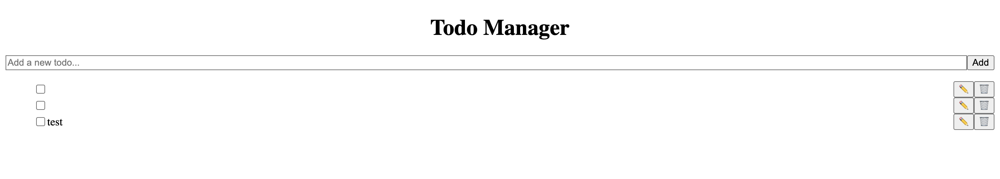

# %% user
Code a modern react-vite-tailwind todo manager app with features to add, delete, edit, mark as done.
Create in /tmp/app-react-vite-91z
# %% assistant
Okay, I can create that React-Vite-Tailwind Todo manager app for you.

```tool_call
<tool_call>
<tool_name>Initialize</tool_name>
<param name="type">first_call</param>
<param name="any_workspace_path">/tmp/app-react-vite-91z</param>
<param name="initial_files_to_read">[]</param>
<param name="mode_name">wcgw</param>
</tool_call>
```

# %% tool_execute
```
<tool_result>
1 validation error for Initialize
task_id_to_resume
  Field required [type=missing, input_value={'type': 'first_call', 'a...[], 'mode_name': 'wcgw'}, input_type=dict]
    For further information visit https://errors.pydantic.dev/2.11/v/missing
</tool_result>
```

# %% assistant
My apologies, I missed a required field. Let's try initializing again.

```tool_call
<tool_call>
<tool_name>Initialize</tool_name>
<param name="type">first_call</param>
<param name="any_workspace_path">/tmp/app-react-vite-91z</param>
<param name="initial_files_to_read">[]</param>
<param name="task_id_to_resume"></param>
<param name="mode_name">wcgw</param>
</tool_call>
```

# %% tool_execute
<tool_result>
[Tool Result](cmdassets/tool-result-20250414-175951-aa2arn.txt)
</tool_result>

# %% assistant
Okay, the workspace is set up. I'll start by creating a new React project using Vite.

```tool_call
<tool_call>
<tool_name>BashCommand</tool_name>
<param name="action_json">{"command": "npm create vite@latest . -- --template react"}</param>
</tool_call>
```

# %% tool_execute
```
<tool_result>
> npx
> cva . --template react

│
◇  Scaffolding project in /private/tmp/app-react-vite-91z...
│
└  Done. Now run:

  npm install
  npm run dev

---

status = process exited
cwd = /private/tmp/app-react-vite-91z
</tool_result>
```

# %% assistant
Great, the project is scaffolded. Now I'll install the necessary Node modules.

```tool_call
<tool_call>
<tool_name>BashCommand</tool_name>
<param name="action_json">{"command": "npm install"}</param>
</tool_call>
```

# %% tool_execute
```
<tool_result>
⠴

---

status = still running
running for = 3 seconds
cwd = /private/tmp/app-react-vite-91z
</tool_result>
```

# %% assistant
Okay, the installation is still in progress. I'll check the status again.

```tool_call
<tool_call>
<tool_name>BashCommand</tool_name>
<param name="action_json">{"status_check": true}</param>
</tool_call>
```

# %% tool_execute
```
<tool_result>
added 150 packages, and audited 151 packages in 3s

30 packages are looking for funding
  run `npm fund` for details

found 0 vulnerabilities

---

status = process exited
cwd = /private/tmp/app-react-vite-91z
</tool_result>
```

# %% assistant
Okay, the initial dependencies are installed. Now I'll install Tailwind CSS and its related packages.

```tool_call
<tool_call>
<tool_name>BashCommand</tool_name>
<param name="action_json">{"command": "npm install -D tailwindcss postcss autoprefixer"}</param>
</tool_call>
```

# %% tool_execute
```
<tool_result>
added 6 packages, and audited 157 packages in 1s

32 packages are looking for funding
  run `npm fund` for details

found 0 vulnerabilities

---

status = process exited
cwd = /private/tmp/app-react-vite-91z
</tool_result>
```

# %% assistant
Okay, Tailwind CSS packages are installed. Now I'll initialize Tailwind CSS to create the configuration files.

```tool_call
<tool_call>
<tool_name>BashCommand</tool_name>
<param name="action_json">{"command": "npx tailwindcss init -p"}</param>
</tool_call>
```

# %% tool_execute
```
<tool_result>
≈ tailwindcss v4.0.14

Invalid command: init

Usage:
  tailwindcss [options]

Options:
  -i, --input ··········· Input file
  -o, --output ·········· Output file [default: `-`]
  -w, --watch ··········· Watch for changes and rebuild as needed
  -m, --minify ·········· Optimize and minify the output
      --optimize ········ Optimize the output without minifying
      --cwd ············· The current working directory [default: `.`]
  -h, --help ············ Display usage information

---

status = process exited
cwd = /private/tmp/app-react-vite-91z
</tool_result>
```

# %% assistant
Ah, it seems the `init` command is not used in this version of Tailwind CSS. I'll configure it manually.

First, I need to see the contents of the configuration files.

```tool_call
<tool_call>
<tool_name>ReadFiles</tool_name>
<param name="file_paths">["tailwind.config.js", "postcss.config.js", "vite.config.js"]</param>
</tool_call>
```

# %% tool_execute
```
<tool_result>

tailwind.config.js: Failure: file_path should be absolute path, current working directory is /private/tmp/app-react-vite-91z

postcss.config.js: Failure: file_path should be absolute path, current working directory is /private/tmp/app-react-vite-91z

vite.config.js: Failure: file_path should be absolute path, current working directory is /private/tmp/app-react-vite-91z

</tool_result>
```

# %% assistant
My apologies, I need to provide absolute paths for the files. Let me try reading them again.

```tool_call
<tool_call>
<tool_name>ReadFiles</tool_name>
<param name="file_paths">["/private/tmp/app-react-vite-91z/tailwind.config.js", "/private/tmp/app-react-vite-91z/postcss.config.js", "/private/tmp/app-react-vite-91z/vite.config.js"]</param>
</tool_call>
```

# %% tool_execute
```
<tool_result>

/private/tmp/app-react-vite-91z/tailwind.config.js: Error: file /private/tmp/app-react-vite-91z/tailwind.config.js does not exist

/private/tmp/app-react-vite-91z/postcss.config.js: Error: file /private/tmp/app-react-vite-91z/postcss.config.js does not exist

/private/tmp/app-react-vite-91z/vite.config.js
```
import { defineConfig } from 'vite'
import react from '@vitejs/plugin-react'

// https://vite.dev/config/
export default defineConfig({
  plugins: [react()],
})
```
</tool_result>
```

# %% assistant
Okay, it seems the Tailwind configuration files weren't created automatically. I'll create them now.

First, `tailwind.config.js`:

```tool_call
<tool_call>
<tool_name>FileWriteOrEdit</tool_name>
<param name="file_path">/private/tmp/app-react-vite-91z/tailwind.config.js</param>
<param name="percentage_to_change">100</param>
<param name="file_content_or_search_replace_blocks">/** @type {import('tailwindcss').Config} */
export default {
  content: [
    "./index.html",
    "./src/**/*.{js,ts,jsx,tsx}",
  ],
  theme: {
    extend: {},
  },
  plugins: [],
}</param>
</tool_call>
```

# %% tool_execute
```
<tool_result>
Success
</tool_result>
```

# %% assistant
Okay, `tailwind.config.js` is created. Now I'll create `postcss.config.js`.

```tool_call
<tool_call>
<tool_name>FileWriteOrEdit</tool_name>
<param name="file_path">/private/tmp/app-react-vite-91z/postcss.config.js</param>
<param name="percentage_to_change">100</param>
<param name="file_content_or_search_replace_blocks">export default {
  plugins: {
    tailwindcss: {},
    autoprefixer: {},
  },
}</param>
</tool_call>
```

# %% tool_execute
```
<tool_result>
Success
</tool_result>
```

# %% assistant
Okay, `postcss.config.js` is created. Now I need to include the Tailwind directives in the main CSS file. I'll read `src/index.css` first.

```tool_call
<tool_call>
<tool_name>ReadFiles</tool_name>
<param name="file_paths">["/private/tmp/app-react-vite-91z/src/index.css"]</param>
</tool_call>
```

# %% tool_execute
<tool_result>
[Tool Result](cmdassets/tool-result-20250414-180102-xwxxoh.txt)
</tool_result>

# %% assistant
Okay, I have the content of `src/index.css`. Now I'll replace it with the Tailwind directives.

```tool_call
<tool_call>
<tool_name>FileWriteOrEdit</tool_name>
<param name="file_path">/private/tmp/app-react-vite-91z/src/index.css</param>
<param name="percentage_to_change">100</param>
<param name="file_content_or_search_replace_blocks">@tailwind base;
@tailwind components;
@tailwind utilities;</param>
</tool_call>
```

# %% tool_execute
```
<tool_result>
Success
</tool_result>
```

# %% assistant
Okay, Tailwind is configured. Now I'll start building the Todo app component structure. First, let's clean up the default `App.jsx` file. I need to see its current content.

```tool_call
<tool_call>
<tool_name>ReadFiles</tool_name>
<param name="file_paths">["/private/tmp/app-react-vite-91z/src/App.jsx"]</param>
</tool_call>
```

# %% tool_execute
<tool_result>
[Tool Result](cmdassets/tool-result-20250414-180116-s6w0gg.txt)
</tool_result>

# %% assistant
Okay, I'll replace the content of `App.jsx` with the structure for the Todo manager application.

```tool_call
<tool_call>
<tool_name>FileWriteOrEdit</tool_name>
<param name="file_path">/private/tmp/app-react-vite-91z/src/App.jsx</param>
<param name="percentage_to_change">100</param>
<param name="file_content_or_search_replace_blocks">import { useState, useEffect } from 'react';

function App() {
  const [todos, setTodos] = useState(() => {
    // Load todos from local storage or initialize as empty array
    const savedTodos = localStorage.getItem('todos');
    return savedTodos ? JSON.parse(savedTodos) : [];
  });
  const [newTodo, setNewTodo] = useState('');
  const [editingId, setEditingId] = useState(null);
  const [editText, setEditText] = useState('');

  // Save todos to local storage whenever they change
  useEffect(() => {
    localStorage.setItem('todos', JSON.stringify(todos));
  }, [todos]);

  const addTodo = () => {
    if (newTodo.trim() === '') return;
    setTodos([...todos, { id: Date.now(), text: newTodo.trim(), completed: false }]);
    setNewTodo('');
  };

  const handleInputChange = (e) => {
    setNewTodo(e.target.value);
  };

  const handleInputKeyPress = (e) => {
    if (e.key === 'Enter') {
      addTodo();
    }
  };

  const deleteTodo = (id) => {
    setTodos(todos.filter(todo => todo.id !== id));
  };

  const toggleComplete = (id) => {
    setTodos(todos.map(todo =>
      todo.id === id ? { ...todo, completed: !todo.completed } : todo
    ));
  };

  const startEditing = (id, text) => {
    setEditingId(id);
    setEditText(text);
  };

  const cancelEditing = () => {
    setEditingId(null);
    setEditText('');
  };

  const saveEdit = (id) => {
    if (editText.trim() === '') {
      // Optionally delete if text is empty, or just cancel edit
      cancelEditing();
      return;
    }
    setTodos(todos.map(todo =>
      todo.id === id ? { ...todo, text: editText.trim() } : todo
    ));
    setEditingId(null);
    setEditText('');
  };

  const handleEditInputChange = (e) => {
    setEditText(e.target.value);
  };

  const handleEditInputKeyPress = (e, id) => {
    if (e.key === 'Enter') {
      saveEdit(id);
    } else if (e.key === 'Escape') {
      cancelEditing();
    }
  };

  return (
    <div className="min-h-screen bg-gray-100 flex flex-col items-center pt-10">
      <div className="w-full max-w-md bg-white rounded-lg shadow-md p-6">
        <h1 className="text-3xl font-bold mb-6 text-center text-gray-800">Todo Manager</h1>

        {/* Add Todo Input */}
        <div className="flex mb-4">
          <input
            type="text"
            value={newTodo}
            onChange={handleInputChange}
            onKeyPress={handleInputKeyPress}
            placeholder="Add a new todo..."
            className="flex-grow p-2 border border-gray-300 rounded-l-md focus:outline-none focus:ring-2 focus:ring-blue-500"
          />
          <button
            onClick={addTodo}
            className="bg-blue-500 text-white p-2 rounded-r-md hover:bg-blue-600"
          >
            Add
          </button>
        </div>

        {/* Todo List */}
        <ul className="space-y-3">
          {todos.map((todo) => (
            <li
              key={todo.id}
              className={`flex items-center p-3 rounded-md transition-colors duration-200 ${
                todo.completed ? 'bg-green-100' : 'bg-gray-50'
              }`}
            >
              {editingId === todo.id ? (
                // Editing View
                <>
                  <input
                    type="text"
                    value={editText}
                    onChange={handleEditInputChange}
                    onKeyDown={(e) => handleEditInputKeyPress(e, todo.id)}
                    className="flex-grow p-1 border border-gray-300 rounded-md mr-2 focus:outline-none focus:ring-1 focus:ring-blue-500"
                    autoFocus
                  />
                  <button
                    onClick={() => saveEdit(todo.id)}
                    className="text-green-500 hover:text-green-700 mr-2"
                    aria-label="Save edit"
                  >
                    ✔️
                  </button>
                  <button
                    onClick={cancelEditing}
                    className="text-red-500 hover:text-red-700"
                    aria-label="Cancel edit"
                  >
                    ✖️
                  </button>
                </>
              ) : (
                // Default View
                <>
                  <input
                    type="checkbox"
                    checked={todo.completed}
                    onChange={() => toggleComplete(todo.id)}
                    className="mr-3 h-5 w-5 text-blue-500 focus:ring-blue-400 border-gray-300 rounded"
                  />
                  <span className={`flex-grow ${todo.completed ? 'line-through text-gray-500' : 'text-gray-800'}`}>
                    {todo.text}
                  </span>
                  <button
                    onClick={() => startEditing(todo.id, todo.text)}
                    className="text-yellow-500 hover:text-yellow-700 mr-2"
                    aria-label="Edit todo"
                  >
                    ✏️
                  </button>
                  <button
                    onClick={() => deleteTodo(todo.id)}
                    className="text-red-500 hover:text-red-700"
                    aria-label="Delete todo"
                  >
                    🗑️
                  </button>
                </>
              )}
            </li>
          ))}
        </ul>
        {todos.length === 0 && (
           <p className="text-center text-gray-500 mt-4">No todos yet!</p>
        )}
      </div>
    </div>
  );
}

export default App;

</param>
</tool_call>
```

# %% tool_execute
```
<tool_result>
Success
</tool_result>
```

# %% assistant
Okay, the core code for the Todo manager application is now in `src/App.jsx`. I've set up the state management, local storage persistence, and the functions for adding, deleting, editing, and marking todos as complete, along with basic Tailwind styling.

You can run the development server with `npm run dev` in the `/private/tmp/app-react-vite-91z` directory to see it in action.

Would you like me to explain any part of the code?

# %% user
Run it
# %% assistant
Okay, I will start the development server.

```tool_call
<tool_call>
<tool_name>BashCommand</tool_name>
<param name="action_json">{"command": "npm run dev"}</param>
</tool_call>
```

# %% tool_execute
```
<tool_result>
VITE v6.2.6  ready in 617 ms

  ➜  Local:   http://localhost:5173/
  ➜  Network: use --host to expose
  ➜  press h + enter to show help

---

status = still running
running for = 3 seconds
cwd = /private/tmp/app-react-vite-91z
</tool_result>
```

# %% assistant
The development server is now running. You can access the Todo app at http://localhost:5173/.

# %% user
[plugin:vite:css] [postcss] It looks like you're trying to use `tailwindcss` directly as a PostCSS plugin. The PostCSS plugin has moved to a separate package, so to continue using Tailwind CSS with PostCSS you'll need to install `@tailwindcss/postcss` and update your PostCSS configuration.

# %% assistant
Okay, it seems there's a change in how Tailwind CSS integrates with PostCSS. I need to stop the server, install a new package, and update the configuration.

First, I'll stop the development server.

```tool_call
<tool_call>
<tool_name>BashCommand</tool_name>
<param name="action_json">{"send_specials": ["Ctrl-c"]}</param>
</tool_call>
```

# %% tool_execute
```
<tool_result>
11:32:29 PM [vite] Internal server error: [postcss] It looks like you're trying to use `tailwindcss` directly as a PostCSS plugin. The PostCSS plugin has moved
to a separate package, so to continue using Tailwind CSS with PostCSS you'll need to install `@tailwindcss/postcss` and update your PostCSS configuration.
  Plugin: vite:css
  File: /private/tmp/app-react-vite-91z/src/index.css:undefined:NaN
      at Le (/private/tmp/app-react-vite-91z/node_modules/tailwindcss/dist/lib.js:36:1984)
      at LazyResult.runOnRoot (/private/tmp/app-react-vite-91z/node_modules/postcss/lib/lazy-result.js:361:16)
      at LazyResult.runAsync (/private/tmp/app-react-vite-91z/node_modules/postcss/lib/lazy-result.js:290:26)
      at LazyResult.async (/private/tmp/app-react-vite-91z/node_modules/postcss/lib/lazy-result.js:192:30)
      at LazyResult.then (/private/tmp/app-react-vite-91z/node_modules/postcss/lib/lazy-result.js:436:17)
^C

---

status = process exited
cwd = /private/tmp/app-react-vite-91z
</tool_result>
```

# %% assistant
Okay, the server is stopped. Now I'll install the `@tailwindcss/postcss` package as suggested by the error message.

```tool_call
<tool_call>
<tool_name>BashCommand</tool_name>
<param name="action_json">{"command": "npm install -D @tailwindcss/postcss"}</param>
</tool_call>
```

# %% tool_execute
```
<tool_result>
added 12 packages, and audited 169 packages in 2s

35 packages are looking for funding
  run `npm fund` for details

found 0 vulnerabilities

---

status = process exited
cwd = /private/tmp/app-react-vite-91z
</tool_result>
```

# %% assistant
Okay, the package is installed. Now I need to update the `postcss.config.js` file. I'll read it first to see the current configuration.

```tool_call
<tool_call>
<tool_name>ReadFiles</tool_name>
<param name="file_paths">["/private/tmp/app-react-vite-91z/postcss.config.js"]</param>
</tool_call>
```

# %% tool_execute
```
<tool_result>

/private/tmp/app-react-vite-91z/postcss.config.js
```
export default {
  plugins: {
    tailwindcss: {},
    autoprefixer: {},
  },
}
```
</tool_result>
```

# %% assistant
Okay, I'll update the `postcss.config.js` to use the new package name.

```tool_call
<tool_call>
<tool_name>FileWriteOrEdit</tool_name>
<param name="file_path">/private/tmp/app-react-vite-91z/postcss.config.js</param>
<param name="percentage_to_change">20</param>
<param name="file_content_or_search_replace_blocks"><![CDATA[<<<<<<< SEARCH
export default {
  plugins: {
    tailwindcss: {},
    autoprefixer: {},
  },
}
=======
export default {
  plugins: {
    '@tailwindcss/postcss': {},
    autoprefixer: {},
  },
}
>>>>>>> REPLACE]]></param>
</tool_call>
```

# %% tool_execute
```
<tool_result>
Edited successfully
</tool_result>
```

# %% assistant
Okay, the PostCSS configuration is updated. Let's try running the development server again.

```tool_call
<tool_call>
<tool_name>BashCommand</tool_name>
<param name="action_json">{"command": "npm run dev"}</param>
</tool_call>
```

# %% tool_execute
```
<tool_result>
> app-react-vite-91z@0.0.0 dev
> vite

11:33:04 PM [vite] (client) Re-optimizing dependencies because lockfile has changed

  VITE v6.2.6  ready in 1022 ms

  ➜  Local:   http://localhost:5173/
  ➜  Network: use --host to expose
  ➜  press h + enter to show help

---

status = still running
running for = 3 seconds
cwd = /private/tmp/app-react-vite-91z
</tool_result>
```

# %% assistant
Okay, the development server is running again, and the PostCSS issue should be resolved. You can access the Todo app at http://localhost:5173/.

The requested Todo manager app has been created with the specified features.

```tool_call
<tool_call>
<tool_name>mark_task_completed</tool_name>
<param name=""></param>
</tool_call>
```

# %% tool_execute
```
<tool_result>
Task marked as completed.
</tool_result>
```

# %% assistant
The application is now running. Would you like me to explain or break down any part of the code?

# %% user
