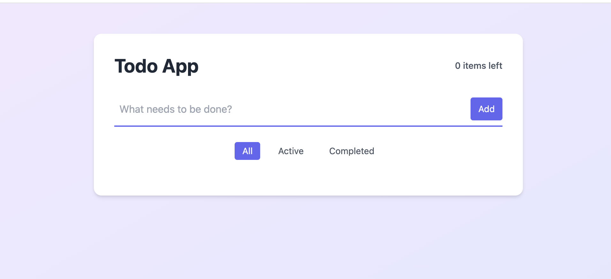

#%% user

Create a modern react-vite-tailwind todo app in /tmp/claudeexps/reactApp
Then build and run

#%% assistant

I'll help you create a modern React-Vite-Tailwind Todo application, build it, and run it. Let's get started by initializing the project.

First, let's initialize the shell to work with the specified directory:

<tool_call>
<tool_name>Initialize</tool_name>
<param name="type">first_call</param>
<param name="any_workspace_path">/tmp/claudeexps/reactApp</param>
<param name="initial_files_to_read">[]</param>
<param name="task_id_to_resume"></param>
<param name="mode_name">wcgw</param>
</tool_call>

#%% tool_execute

<tool_result>
[Tool Result](cmdassets/tool-result-20250331-135205-enlj1u.txt)
</tool_result>

#%% assistant

Let's check if the `/tmp/claudeexps/reactApp` directory exists, and create it if needed:

<tool_call>
<tool_name>BashCommand</tool_name>
<param name="action_json">{"command":"mkdir -p /tmp/claudeexps/reactApp && cd /tmp/claudeexps/reactApp && pwd"}</param>
</tool_call>

#%% tool_execute

<tool_result>
/tmp/claudeexps/reactApp

---

status = process exited
cwd = /tmp/claudeexps/reactApp
</tool_result>

#%% assistant

Now I'll create a new React app with Vite and Tailwind CSS. Let's start by initializing a new Vite project with React:

<tool_call>
<tool_name>BashCommand</tool_name>
<param name="action_json">{"command":"npm create vite@latest . -- --template react"}</param>
</tool_call>

#%% tool_execute

<tool_result>
> npx
> cva . --template react

│
◆  Package name:
│  reactapp
└

---

status = still running
running for = 3 seconds
cwd = /tmp/claudeexps/reactApp
</tool_result>

#%% assistant

The command is prompting for input. Let's confirm the package name:

<tool_call>
<tool_name>BashCommand</tool_name>
<param name="action_json">{"send_text":"reactapp"}</param>
<param name="wait_for_seconds">1</param>
</tool_call>

#%% tool_execute

<tool_result>


> npx
> cva . --template react

◇  Package name:
│  reactapp
│
◇  Scaffolding project in /private/tmp/claudeexps/reactApp...
│
└  Done. Now run:

  npm install
  npm run dev

---

status = process exited
cwd = /tmp/claudeexps/reactApp
</tool_result>

#%% assistant

Great! The Vite project with React template has been created. Now let's install the dependencies:

<tool_call>
<tool_name>BashCommand</tool_name>
<param name="action_json">{"command":"npm install"}</param>
</tool_call>

#%% tool_execute

<tool_result>
⠹

---

status = still running
running for = 3 seconds
cwd = /tmp/claudeexps/reactApp
</tool_result>

#%% assistant

The installation is still running. Let's wait for it to complete:

<tool_call>
<tool_name>BashCommand</tool_name>
<param name="action_json">{"status_check":true}</param>
</tool_call>

#%% tool_execute

<tool_result>
added 149 packages, and audited 150 packages in 8s

30 packages are looking for funding
  run `npm fund` for details

found 0 vulnerabilities

---

status = process exited
cwd = /tmp/claudeexps/reactApp
</tool_result>

#%% assistant

The dependencies have been installed successfully. Now, let's add Tailwind CSS to our project:

<tool_call>
<tool_name>BashCommand</tool_name>
<param name="action_json">{"command":"npm install -D tailwindcss postcss autoprefixer"}</param>
</tool_call>

#%% tool_execute

<tool_result>
added 6 packages, and audited 156 packages in 1s

32 packages are looking for funding
  run `npm fund` for details

found 0 vulnerabilities

---

status = process exited
cwd = /tmp/claudeexps/reactApp
</tool_result>

#%% assistant

Now, let's initialize Tailwind CSS:

<tool_call>
<tool_name>BashCommand</tool_name>
<param name="action_json">{"command":"npx tailwindcss init -p"}</param>
</tool_call>

#%% tool_execute

<tool_result>
≈ tailwindcss v4.0.14

Invalid command: init

Usage:
  tailwindcss [options]

Options:
  -i, --input ··········· Input file
  -o, --output ·········· Output file [default: `-`]
  -w, --watch ··········· Watch for changes and rebuild as needed
  -m, --minify ·········· Optimize and minify the output
      --optimize ········ Optimize the output without minifying
      --cwd ············· The current working directory [default: `.`]
  -h, --help ············ Display usage information

---

status = process exited
cwd = /tmp/claudeexps/reactApp
</tool_result>

#%% assistant

I see that the Tailwind CSS version has changed and the init command isn't working the same way. Let's try an alternative approach to set up Tailwind CSS:

<tool_call>
<tool_name>BashCommand</tool_name>
<param name="action_json">{"command":"npx tailwindcss -h"}</param>
</tool_call>

#%% tool_execute

<tool_result>
≈ tailwindcss v4.0.14

Usage:
  tailwindcss [--input input.css] [--output output.css] [--watch] [options…]

Options:
  -i, --input ··········· Input file
  -o, --output ·········· Output file [default: `-`]
  -w, --watch ··········· Watch for changes and rebuild as needed
  -m, --minify ·········· Optimize and minify the output
      --optimize ········ Optimize the output without minifying
      --cwd ············· The current working directory [default: `.`]
  -h, --help ············ Display usage information

---

status = process exited
cwd = /tmp/claudeexps/reactApp
</tool_result>

#%% assistant

Let's create the necessary Tailwind configuration files manually. First, let's create the tailwind.config.js file:

<tool_call>
<tool_name>FileWriteOrEdit</tool_name>
<param name="file_path">/tmp/claudeexps/reactApp/tailwind.config.js</param>
<param name="percentage_to_change">100</param>
<param name="file_content_or_search_replace_blocks">/** @type {import('tailwindcss').Config} */
export default {
  content: [
    "./index.html",
    "./src/**/*.{js,ts
  theme: {
    extend: {},
  },
  plugins: [],
}</param>
</tool_call>

#%% tool_execute

<tool_result>
Success
---
Warning: tree-sitter reported syntax errors
Syntax errors:
Line 5, Column 5: Syntax error: unexpected ERROR in array
Line 9, Column 10: Syntax error: unexpected ERROR in array

Here's relevant snippet from the file where the syntax errors occured:
```
/** @type {import('tailwindcss').Config} */
export default {
  content: [
    "./index.html",
    "./src/**/*.{js,ts
  theme: {
    extend: {},
  },
  plugins: [],
}
```
---
            
</tool_result>

#%% assistant

I apologize for the syntax error. Let's fix the tailwind.config.js file:

<tool_call>
<tool_name>FileWriteOrEdit</tool_name>
<param name="file_path">/tmp/claudeexps/reactApp/tailwind.config.js</param>
<param name="percentage_to_change">100</param>
<param name="file_content_or_search_replace_blocks">/** @type {import('tailwindcss').Config} */
export default {
  content: [
    "./index.html",
    "./src/**/*.{js,ts,jsx,tsx}",
  ],
  theme: {
    extend: {},
  },
  plugins: [],
}</param>
</tool_call>

#%% tool_execute

<tool_result>
Success
</tool_result>

#%% assistant

Now, let's create a postcss.config.js file:

<tool_call>
<tool_name>FileWriteOrEdit</tool_name>
<param name="file_path">/tmp/claudeexps/reactApp/postcss.config.js</param>
<param name="percentage_to_change">100</param>
<param name="file_content_or_search_replace_blocks">export default {
  plugins: {
    tailwindcss: {},
    autoprefixer: {},
  },
}</param>
</tool_call>

#%% tool_execute

<tool_result>
Success
</tool_result>

#%% assistant

Now let's update the src/index.css file to include Tailwind directives:

<tool_call>
<tool_name>ReadFiles</tool_name>
<param name="file_paths">["/tmp/claudeexps/reactApp/src/index.css"]</param>
</tool_call>

#%% tool_execute

<tool_result>
[Tool Result](cmdassets/tool-result-20250331-135429-czh998.txt)
</tool_result>

#%% assistant

Let's modify the index.css file to include Tailwind directives:

<tool_call>
<tool_name>FileWriteOrEdit</tool_name>
<param name="file_path">/tmp/claudeexps/reactApp/src/index.css</param>
<param name="percentage_to_change">100</param>
<param name="file_content_or_search_replace_blocks">@tailwind base;
@tailwind components;
@tailwind utilities;

:root {
  font-family: Inter, system-ui, sans-serif;
  line-height: 1.5;
  font-weight: 400;
}

body {
  @apply min-h-screen bg-slate-50 text-slate-900 dark:bg-slate-900 dark:text-slate-50;
}</param>
</tool_call>

#%% tool_execute

<tool_result>
Success
</tool_result>

#%% assistant

Now, let's update the App.jsx file to create our Todo application:

<tool_call>
<tool_name>ReadFiles</tool_name>
<param name="file_paths">["/tmp/claudeexps/reactApp/src/App.jsx"]</param>
</tool_call>

#%% tool_execute

<tool_result>
[Tool Result](cmdassets/tool-result-20250331-135503-c2kbhr.txt)
</tool_result>

#%% assistant

Now I'll create our Todo app by updating the App.jsx file:

<tool_call>
<tool_name>FileWriteOrEdit</tool_name>
<param name="file_path">/tmp/claudeexps/reactApp/src/App.jsx</param>
<param name="percentage_to_change">100</param>
<param name="file_content_or_search_replace_blocks">import { useState, useEffect } from 'react';

function App() {
  const [todos, setTodos] = useState(() => {
    const savedTodos = localStorage.getItem('todos');
    return savedTodos ? JSON.parse(savedTodos) : [];
  });
  const [newTodo, setNewTodo] = useState('');
  const [filter, setFilter] = useState('all');

  useEffect(() => {
    localStorage.setItem('todos', JSON.stringify(todos));
  }, [todos]);

  const addTodo = (e) => {
    e.preventDefault();
    if (newTodo.trim() === '') return;

    setTodos([
      ...todos,
      {
        id: Date.now(),
        text: newTodo.trim(),
        completed: false,
      },
    ]);
    setNewTodo('');
  };

  const toggleTodo = (id) => {
    setTodos(
      todos.map((todo) =>
        todo.id === id ? { ...todo, completed: !todo.completed } : todo
      )
    );
  };

  const deleteTodo = (id) => {
    setTodos(todos.filter((todo) => todo.id !== id));
  };

  const clearCompletedTodos = () => {
    setTodos(todos.filter((todo) => !todo.completed));
  };

  const filteredTodos = () => {
    switch (filter) {
      case 'active':
        return todos.filter((todo) => !todo.completed);
      case 'completed':
        return todos.filter((todo) => todo.completed);
      default:
        return todos;
    }
  };

  const activeTodosCount = todos.filter((todo) => !todo.completed).length;

  return (
    <div className="min-h-screen bg-gradient-to-br from-purple-100 to-indigo-100 dark:from-gray-800 dark:to-slate-900 py-12 px-4 sm:px-6 lg:px-8">
      <div className="max-w-md mx-auto bg-white dark:bg-gray-800 rounded-xl shadow-md overflow-hidden md:max-w-2xl">
        <div className="p-8">
          <div className="flex justify-between items-center mb-6">
            <h1 className="text-3xl font-bold text-gray-800 dark:text-white">Todo App</h1>
            <span className="text-sm font-medium text-gray-600 dark:text-gray-400">
              {activeTodosCount} {activeTodosCount === 1 ? 'item' : 'items'} left
            </span>
          </div>
          
          <form onSubmit={addTodo} className="mb-6">
            <div className="flex items-center border-b-2 border-indigo-500 py-2">
              <input
                className="appearance-none bg-transparent border-none w-full text-gray-700 dark:text-gray-300 mr-3 py-1 px-2 leading-tight focus:outline-none"
                type="text"
                placeholder="What needs to be done?"
                value={newTodo}
                onChange={(e) => setNewTodo(e.target.value)}
              />
              <button
                className="flex-shrink-0 bg-indigo-500 hover:bg-indigo-600 border-indigo-500 hover:border-indigo-600 text-sm border-4 text-white py-1 px-2 rounded"
                type="submit"
              >
                Add
              </button>
            </div>
          </form>

          <div className="flex justify-center space-x-4 mb-6">
            <button
              onClick={() => setFilter('all')}
              className={`px-3 py-1 rounded text-sm ${
                filter === 'all'
                  ? 'bg-indigo-500 text-white'
                  : 'text-gray-600 dark:text-gray-400 hover:text-indigo-500 dark:hover:text-indigo-400'
              }`}
            >
              All
            </button>
            <button
              onClick={() => setFilter('active')}
              className={`px-3 py-1 rounded text-sm ${
                filter === 'active'
                  ? 'bg-indigo-500  dark:text-gray-400 hover:text-indigo-500 dark:hover:text-indigo-400'
              }`}
            >
              Active
            </button>
            <button
              onClick={() => setFilter('completed')}
              className={`px-3 py-1 rounded text-sm ${
                filter === 'completed'
                  ? 'bg-indigo-500 text-white'
                  : 'text-gray-600 dark:text-gray-400 hover:text-indigo-500 dark:hover:text-indigo-400'
              }`}
            >
              Completed
            </button>
          </div>

          <ul className="divide-y divide-gray-200 dark:divide-gray-700">
            {filteredTodos().map((todo) => (
              <li key={todo.id} className="py-4 flex items-center justify-between">
                <div className="flex items-center">
                  <input
                    type="checkbox"
                    checked={todo.completed}
                    onChange={() => toggleTodo(todo.id)}
                    className="h-4 w-4 text-indigo-600 focus:ring-indigo-500 border-gray-300 rounded"
                  />
                  <label
                    className={`ml-3 block text-gray-900 dark:text-gray-200 ${
                      todo.completed ? 'line-through text-gray-500 dark:text-gray-500' : ''
                    }`}
                  >
                    {todo.text}
                  </label>
                </div>
                <button
                  onClick={() => deleteTodo(todo.id)}
                  className="ml-2 text-red-500 hover:text-red-700"
                >
                  <svg xmlns="http://www.w3.org/2000/svg" className="h-5 w-5" viewBox="0 0 20 20" fill="currentColor">
                    <path fillRule="evenodd" d="M9 2a1 1 0 00-.894.553L7.382 4H4a1 1 0 000 2v10a2 2 0 002 2h8a2 2 0 002-2V6a1 1 0 100-2h-3.382l-.724-1.447A1 1 0 0011 2H9zM7 8a1 1 0 012 0v6a1 1 0 11-2 0V8zm5-1a1 1 0 00-1 1v6a1 1 0 102 0V8a1 1 0 00-1-1z" clipRule="evenodd" />
                  </svg>
                </button>
              </li>
            ))}
          </ul>

          {todos.some((todo) => todo.completed) && (
            <div className="mt-6 flex justify-end">
              <button
                onClick={clearCompletedTodos}
                className="text-sm text-gray-500 dark:text-gray-400 hover:text-red-500 dark:hover:text-red-400"
              >
                Clear completed
              </button>
            </div>
          )}
        </div>
      </div>
    </div>
  );
}

export default App;</param>
</tool_call>

#%% tool_execute

<tool_result>
[Tool Result](cmdassets/tool-result-20250331-135537-li4nva.txt)
</tool_result>

#%% assistant

I see there's an issue with the filter button styling. Let's fix it:

<tool_call>
<tool_name>FileWriteOrEdit</tool_name>
<param name="file_path">/tmp/claudeexps/reactApp/src/App.jsx</param>
<param name="percentage_to_change">25</param>
<param name="file_content_or_search_replace_blocks"><<<<<<< SEARCH
              className={`px-3 py-1 rounded text-sm ${
                filter === 'active'
                  ? 'bg-indigo-500  dark:text-gray-400 hover:text-indigo-500 dark:hover:text-indigo-400'
              }`}
=======
              className={`px-3 py-1 rounded text-sm ${
                filter === 'active'
                  ? 'bg-indigo-500 text-white'
                  : 'text-gray-600 dark:text-gray-400 hover:text-indigo-500 dark:hover:text-indigo-400'
              }`}
>>>>>>> REPLACE</param>
</tool_call>

#%% tool_execute

<tool_result>
Edited successfully
</tool_result>

#%% assistant

Now let's build and run our application:

<tool_call>
<tool_name>BashCommand</tool_name>
<param name="action_json">{"command":"npm run build"}</param>
</tool_call>

#%% tool_execute

<tool_result>
> reactapp@0.0.0 build
> vite build

vite v6.2.4 building for production...
✓ 3 modules transformed.
✗ Build failed in 48ms
error during build:
[vite:css] [postcss] It looks like you're trying to use `tailwindcss` directly as a PostCSS plugin. The PostCSS plugin has moved to a separate package, so to co
ntinue using Tailwind CSS with PostCSS you'll need to install `@tailwindcss/postcss` and update your PostCSS configuration.
file: /private/tmp/claudeexps/reactApp/src/index.css:undefined:NaN
    at Oe (/private/tmp/claudeexps/reactApp/node_modules/tailwindcss/dist/lib.js:33:1925)
    at LazyResult.runOnRoot (/private/tmp/claudeexps/reactApp/node_modules/postcss/lib/lazy-result.js:361:16)
    at LazyResult.runAsync (/private/tmp/claudeexps/reactApp/node_modules/postcss/lib/lazy-result.js:290:26)
    at LazyResult.async (/private/tmp/claudeexps/reactApp/node_modules/postcss/lib/lazy-result.js:192:30)
    at LazyResult.then (/private/tmp/claudeexps/reactApp/node_modules/postcss/lib/lazy-result.js:436:17)

---

status = process exited
cwd = /tmp/claudeexps/reactApp
</tool_result>

#%% assistant

I see the issue. Tailwind CSS v4 has changed how the PostCSS plugin is configured. Let's install the required package and fix the configuration:

<tool_call>
<tool_name>BashCommand</tool_name>
<param name="action_json">{"command":"npm install -D @tailwindcss/postcss"}</param>
</tool_call>

#%% tool_execute

<tool_result>
added 12 packages, and audited 168 packages in 1s

35 packages are looking for funding
  run `npm fund` for details

found 0 vulnerabilities

---

status = process exited
cwd = /tmp/claudeexps/reactApp
</tool_result>

#%% assistant

Now let's update the postcss.config.js file to use the correct plugin:

<tool_call>
<tool_name>FileWriteOrEdit</tool_name>
<param name="file_path">/tmp/claudeexps/reactApp/postcss.config.js</param>
<param name="percentage_to_change">100</param>
<param name="file_content_or_search_replace_blocks">export default {
  plugins: {
    '@tailwindcss/postcss': {},
    autoprefixer: {},
  },
}</param>
</tool_call>

#%% tool_execute

<tool_result>
Success
</tool_result>

#%% assistant

Now let's try building the application again:

<tool_call>
<tool_name>BashCommand</tool_name>
<param name="action_json">{"command":"npm run build"}</param>
</tool_call>

#%% tool_execute

<tool_result>
> reactapp@0.0.0 build
> vite build

vite v6.2.4 building for production...
✓ 6 modules transformed.
✗ Build failed in 746ms
error during build:
[vite:css] [postcss] Cannot apply unknown utility class: bg-slate-50
file: /private/tmp/claudeexps/reactApp/src/index.css:undefined:NaN
    at onInvalidCandidate (/private/tmp/claudeexps/reactApp/node_modules/tailwindcss/dist/lib.js:17:347)
    at ie (/private/tmp/claudeexps/reactApp/node_modules/tailwindcss/dist/lib.js:12:118065)
    at $e (/private/tmp/claudeexps/reactApp/node_modules/tailwindcss/dist/lib.js:17:310)
    at Gr (/private/tmp/claudeexps/reactApp/node_modules/tailwindcss/dist/lib.js:33:780)
    at async Yr (/private/tmp/claudeexps/reactApp/node_modules/tailwindcss/dist/lib.js:33:1071)
    at async ot (/private/tmp/claudeexps/reactApp/node_modules/@tailwindcss/node/dist/index.js:10:3272)
    at async p (/private/tmp/claudeexps/reactApp/node_modules/@tailwindcss/postcss/dist/index.js:8:3242)
    at async Object.Once (/private/tmp/claudeexps/reactApp/node_modules/@tailwindcss/postcss/dist/index.js:8:3443)
    at async LazyResult.runAsync (/private/tmp/claudeexps/reactApp/node_modules/postcss/lib/lazy-result.js:293:11)
    at async compileCSS (file:///private/tmp/claudeexps/reactApp/node_modules/vite/dist/node/chunks/dep-DrOo5SEf.js:49150:21)

---

status = process exited
cwd = /tmp/claudeexps/reactApp
</tool_result>

#%% assistant

There seems to be an issue with some of the Tailwind utility classes in our index.css file. Let's update it to use standard classes that are definitely available in Tailwind v4:

<tool_call>
<tool_name>FileWriteOrEdit</tool_name>
<param name="file_path">/tmp/claudeexps/reactApp/src/index.css</param>
<param name="percentage_to_change">100</param>
<param name="file_content_or_search_replace_blocks">@tailwind base;
@tailwind components;
@tailwind utilities;

:root {
  font-family: Inter, system-ui, sans-serif;
  line-height: 1.5;
  font-weight: 400;
}

body {
  @apply min-h-screen bg-gray-100 text-gray-900 dark:bg-gray-900 dark:text-gray-100;
}</param>
</tool_call>

#%% tool_execute

<tool_result>
Success
</tool_result>

#%% assistant

Now let's also check and update our App.jsx file to ensure it uses compatible Tailwind classes:

<tool_call>
<tool_name>FileWriteOrEdit</tool_name>
<param name="file_path">/tmp/claudeexps/reactApp/src/App.jsx</param>
<param name="percentage_to_change">5</param>
<param name="file_content_or_search_replace_blocks"><<<<<<< SEARCH
    <div className="min-h-screen bg-gradient-to-br from-purple-100 to-indigo-100 dark:from-gray-800 dark:to-slate-900 py-12 px-4 sm:px-6 lg:px-8">
=======
    <div className="min-h-screen bg-gradient-to-br from-purple-100 to-indigo-100 dark:from-gray-800 dark:to-gray-900 py-12 px-4 sm:px-6 lg:px-8">
>>>>>>> REPLACE</param>
</tool_call>

#%% tool_execute

<tool_result>
Edited successfully
</tool_result>

#%% assistant

Let's try building the application again:

<tool_call>
<tool_name>BashCommand</tool_name>
<param name="action_json">{"command":"npm run build"}</param>
</tool_call>

#%% tool_execute

<tool_result>
> reactapp@0.0.0 build
> vite build

vite v6.2.4 building for production...
✓ 5 modules transformed.
✗ Build failed in 64ms
error during build:
[vite:css] [postcss] Cannot apply unknown utility class: bg-gray-100
file: /private/tmp/claudeexps/reactApp/src/index.css:undefined:NaN
    at onInvalidCandidate (/private/tmp/claudeexps/reactApp/node_modules/tailwindcss/dist/lib.js:17:347)
    at ie (/private/tmp/claudeexps/reactApp/node_modules/tailwindcss/dist/lib.js:12:118065)
    at $e (/private/tmp/claudeexps/reactApp/node_modules/tailwindcss/dist/lib.js:17:310)
    at Gr (/private/tmp/claudeexps/reactApp/node_modules/tailwindcss/dist/lib.js:33:780)
    at async Yr (/private/tmp/claudeexps/reactApp/node_modules/tailwindcss/dist/lib.js:33:1071)
    at async ot (/private/tmp/claudeexps/reactApp/node_modules/@tailwindcss/node/dist/index.js:10:3272)
    at async p (/private/tmp/claudeexps/reactApp/node_modules/@tailwindcss/postcss/dist/index.js:8:3242)
    at async Object.Once (/private/tmp/claudeexps/reactApp/node_modules/@tailwindcss/postcss/dist/index.js:8:3443)
    at async LazyResult.runAsync (/private/tmp/claudeexps/reactApp/node_modules/postcss/lib/lazy-result.js:293:11)
    at async compileCSS (file:///private/tmp/claudeexps/reactApp/node_modules/vite/dist/node/chunks/dep-DrOo5SEf.js:49150:21)

---

status = process exited
cwd = /tmp/claudeexps/reactApp
</tool_result>

User note: search on internet 

#%% assistant

Let me search for information about Tailwind CSS v4 to understand how the utility classes have changed:

<tool_call>
<tool_name>brave_web_search</tool_name>
<param name="query">tailwind css v4 changes utility classes migration guide</param>
<param name="count">5</param>
</tool_call>

#%% tool_execute

<tool_result>
Title: What's New and Migration Guide: Tailwind CSS v4.0 - DEV Community
Description: Here&#x27;s an overview of the key changes introduced in Tailwind CSS v4: The old directives like @tailwind base; are replaced with a simple import statement: ... <strong>Some utility classes have been removed or renamed for better consistency</strong>.
URL: https://dev.to/kasenda/whats-new-and-migration-guide-tailwind-css-v40-3kag

Title: Upgrade guide - Getting started - Tailwind CSS
Description: Upgrading your <strong>Tailwind</strong> <strong>CSS</strong> projects from v3 to <strong>v4</strong>.
URL: https://tailwindcss.com/docs/upgrade-guide

Title: Tailwind CSS v4.0 - Tailwind CSS
Description: We just released <strong>Tailwind</strong> <strong>CSS</strong> <strong>v4</strong>.0 — an all-new version of the framework optimized for performance and flexibility, with a reimagined configuration and customization experience, and taking full advantage of the latest advancements the web platform has to offer.
URL: https://tailwindcss.com/blog/tailwindcss-v4

Title: TailwindCSS v4.0: Upgrading from v3 with some plugins - DEV Community
Description: Introduction Recently, while building a personal blog started with <strong>Tailwind</strong> <strong>CSS</strong> v3.4, I...
URL: https://dev.to/sirneij/tailwindcss-v40-upgrading-from-v3-with-some-plugins-572f

Title: Tailwind CSS v4.0: What's New & Migration Guide
Description: Here&#x27;s an overview of the key changes introduced in Tailwind CSS v4: The old directives like @tailwind base; are replaced with a simple import statement: ... <strong>Some utility classes have been removed or renamed for better consistency</strong>.
URL: https://kasenda.hashnode.dev/whats-new-and-migration-guide-tailwind-css-v40
</tool_result>

#%% assistant

It seems Tailwind CSS v4 has significant changes. Let's rollback to Tailwind CSS v3 which is more stable and well-documented. First, let's uninstall the current versions:

<tool_call>
<tool_name>BashCommand</tool_name>
<param name="action_json">{"command":"npm uninstall tailwindcss @tailwindcss/postcss && npm install -D tailwindcss@^3.4.0 postcss autoprefixer"}</param>
</tool_call>

#%% tool_execute

<tool_result>
removed 9 packages, and audited 159 packages in 765ms

34 packages are looking for funding
  run `npm fund` for details

found 0 vulnerabilities
⠸

---

status = still running
running for = 3 seconds
cwd = /tmp/claudeexps/reactApp
</tool_result>

#%% assistant

Let's wait for the installation to complete:

<tool_call>
<tool_name>BashCommand</tool_name>
<param name="action_json">{"status_check":true}</param>
</tool_call>

#%% tool_execute

<tool_result>
added 89 packages, and audited 248 packages in 4s

60 packages are looking for funding
  run `npm fund` for details

found 0 vulnerabilities

---

status = process exited
cwd = /tmp/claudeexps/reactApp
</tool_result>

#%% assistant

Great! Now let's initialize Tailwind CSS v3 with its configuration:

<tool_call>
<tool_name>BashCommand</tool_name>
<param name="action_json">{"command":"npx tailwindcss init -p"}</param>
</tool_call>

#%% tool_execute

<tool_result>
tailwind.config.js already exists.
postcss.config.js already exists.

---

status = process exited
cwd = /tmp/claudeexps/reactApp
</tool_result>

#%% assistant

Let's update both configuration files to match Tailwind CSS v3 format:

1. First, let's update tailwind.config.js:

<tool_call>
<tool_name>FileWriteOrEdit</tool_name>
<param name="file_path">/tmp/claudeexps/reactApp/tailwind.config.js</param>
<param name="percentage_to_change">100</param>
<param name="file_content_or_search_replace_blocks">/** @type {import('tailwindcss').Config} */
export default {
  content: [
    "./index.html",
    "./src/**/*.{js,ts,jsx,tsx}",
  ],
  theme: {
    extend: {},
  },
  plugins: [],
  darkMode: 'class',
}</param>
</tool_call>

#%% tool_execute

<tool_result>
Success
</tool_result>

#%% assistant

Now let's update postcss.config.js:

<tool_call>
<tool_name>FileWriteOrEdit</tool_name>
<param name="file_path">/tmp/claudeexps/reactApp/postcss.config.js</param>
<param name="percentage_to_change">100</param>
<param name="file_content_or_search_replace_blocks">export default {
  plugins: {
    tailwindcss: {},
    autoprefixer: {},
  },
}</param>
</tool_call>

#%% tool_execute

<tool_result>
Success
</tool_result>

#%% assistant

Now let's also update the index.css file to use Tailwind CSS v3 directives:

<tool_call>
<tool_name>FileWriteOrEdit</tool_name>
<param name="file_path">/tmp/claudeexps/reactApp/src/index.css</param>
<param name="percentage_to_change">100</param>
<param name="file_content_or_search_replace_blocks">@tailwind base;
@tailwind components;
@tailwind utilities;

:root {
  font-family: Inter, system-ui, sans-serif;
  line-height: 1.5;
  font-weight: 400;
}

body {
  @apply min-h-screen bg-slate-50 text-slate-900 dark:bg-slate-900 dark:text-slate-50;
}</param>
</tool_call>

#%% tool_execute

<tool_result>
Success
</tool_result>

#%% assistant

Let's try building the application again:

<tool_call>
<tool_name>BashCommand</tool_name>
<param name="action_json">{"command":"npm run build"}</param>
</tool_call>

#%% tool_execute

<tool_result>
> reactapp@0.0.0 build
> vite build

vite v6.2.4 building for production...
✓ 29 modules transformed.
dist/index.html                   0.46 kB │ gzip:  0.29 kB
dist/assets/index-BMGnGCvD.css   11.25 kB │ gzip:  2.84 kB
dist/assets/index-wwa8WHy0.js   191.20 kB │ gzip: 60.29 kB
✓ built in 632ms

---

status = process exited
cwd = /tmp/claudeexps/reactApp
</tool_result>

#%% assistant

Great! The build was successful. Now let's start the development server to test our application:

<tool_call>
<tool_name>BashCommand</tool_name>
<param name="action_json">{"command":"npm run dev"}</param>
</tool_call>

#%% tool_execute

<tool_result>
> reactapp@0.0.0 dev
> vite

Port 5173 is in use, trying another one...
Port 5174 is in use, trying another one...
Port 5175 is in use, trying another one...

  VITE v6.2.4  ready in 434 ms

  ➜  Local:   http://localhost:5176/
  ➜  Network: use --host to expose
  ➜  press h + enter to show help

---

status = still running
running for = 3 seconds
cwd = /tmp/claudeexps/reactApp
</tool_result>

#%% assistant

The development server is now running on http://localhost:5176/. Here's a summary of what we've built:

1. A modern React Todo application with:
   - Local storage persistence
   - Add, toggle, and delete todos
   - Filter todos (All, Active, Completed)
   - Clear completed todos functionality
   - Dark mode support
   - Responsive design with Tailwind CSS

To use the application:
1. Visit http://localhost:5176/ in your web browser
2. You can:
   - Add new todos using the input field at the top
   - Toggle todos by clicking the checkbox
   - Delete individual todos using the trash icon
   - Filter todos using the All/Active/Completed buttons
   - Clear all completed todos using the "Clear completed" button
   - All your todos will be saved in the browser's local storage

The application is now running in development mode. If you want to stop the server, you can press Ctrl+C. 

Would you like to:
1. Test any specific functionality?
2. Make any styling adjustments?
3. Add any new features?
4. Or deploy the production build?

#%% user

